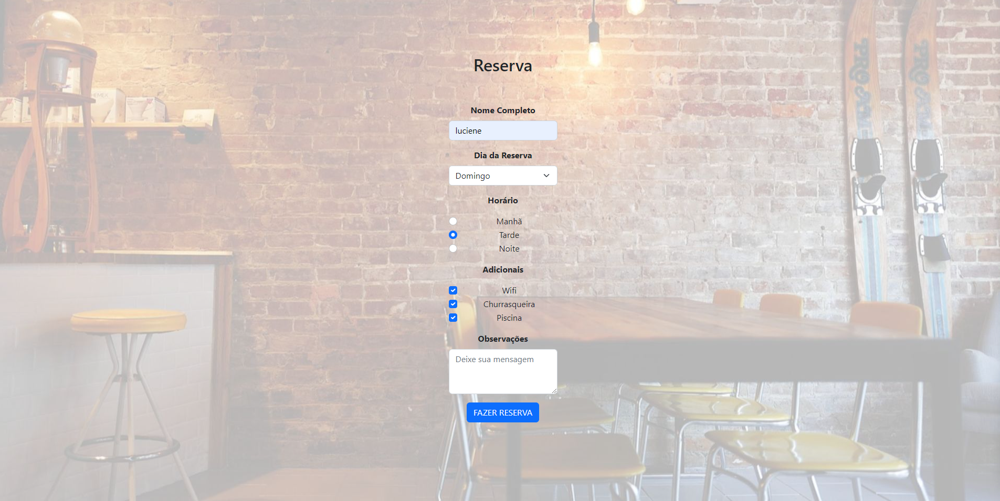

  

 

# Reserva para restaurante
🎉 Novo Projeto Publicado! 🎉

Há algum tempo, criei um formulário utilizando React 🚀

 
<h3 align="center">Desenvolvido em: </h3>

    
    
    
    
    

 

### 📘 Ferramentas/Bibliotecas utilizadas
  - Biblioteca para criação de interfaces: `reactJS`
  - Setup para criar o projeto no React: `ViteJS`
  - Layout: `Bootstrap`  

  ## ✔️ Autores

- [LucieneFreitas](https://github.com/LucieneFreitas)

## 📄 Referência

- [Programação Web](https://curso.programacaoweb.com.br/)